# SIMPLE_CALCULATOR

**Author**: Yuchen Lei  *[yuchenl@kth.se](mailto:yuchenl@kth.se)*

This is the repo for PROGRAMMING ASSIGNMENT – SIMPLE CALCULATOR

## File structure

```cmd
SIMPLE_CALCULATOR
|-- README.md
|-- main.py
|-- test_1.txt # test files
|-- test_2.txt
|-- test_3.txt
|
|-- fig # the results figures
 
```

## How to set up Python environment

The code is written in Python (version 3.6.13 or later).

First,  open a command prompt as administrator by typing *cmd* in search box. And then type in the following command to see if Python is installed.

```cmd
python --version
```

If you see an error, it needs to be installed.  Copy the following link: https://www.python.org/downloads/ and head to the browser. Once there, click the *Download Python* button. Execute the downloaded file, and in the installer, please check the box to "*Add Python to PATH*". Then hit the *Install Now* button. This will install Python and *pip*, the Python package manager.

## How to run and test the code

First,  open a command prompt  by typing *cmd* in search box.  Then change the directory to the SIMPLE_CALCULATOR folder by typing:

```cmd
cd path/to/SIMPLE_CALCULATOR
```

If the folder is stored in another drive (e.g. D:\), you need to first change the drive:

```cmd
D:
```

The program can either take its input from the standard input stream, 

```cmd
python main.py
```

or from a text file.

```cmd
python main.py test_1.txt
```

*test_1. txt, test_2. txt, test_3. txt* are three examples specified in the pdf file. Please have a try. 

## Assumptions

To make the problem more clear regarding details, I make the following assumptions:
(1) Any name consisting of alphanumeric characters are allowed as register names, except for pure numeric names (e.g. "123").

(2) Operations are performed sequentially without operation priority, e.g.  when entering 

​	A add B

​	A multiply C

​	The value of A will be (A+B) * C.

(3) Only integer values are supported. (e.g. *A add 1.4*  will be considered an invalid command)

(4) There are four accepted syntaxes: 

​	print \<register>,  

​	quit,  

​	\<register> \<operation> \<value>,  

​	<register_1> \<operation> <register_2>

Conditions are examined for the above syntaxes. Invalid commands will be ignored, and warnings will be logged to the console.

(4)  My understanding of lazy evaluation (evaluated at print) is that the operations between different registers are first defined sequentially, and then when printing, those operations will be solved (similar to solving a multivariate linear system.). If they are solvable, the value of the register will be printed, but if they are not solvable, the print command will be considered invalid.

## Results 

(1) Read input from the standard input stream:

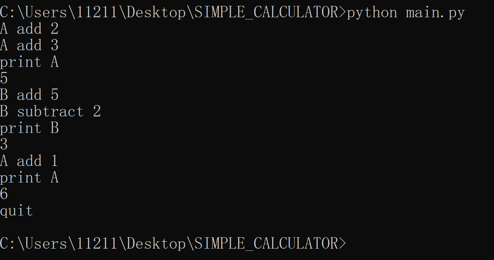

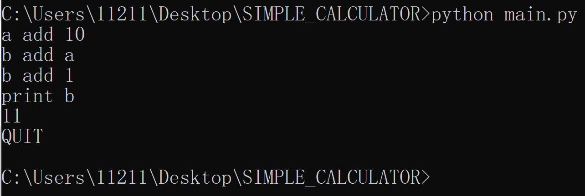

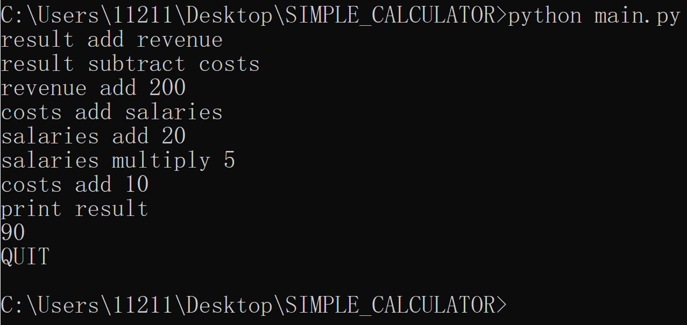

(2) Read input from from a text file (The file is specified in the argument):

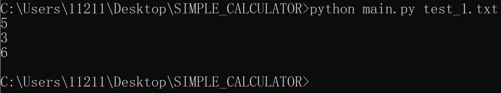

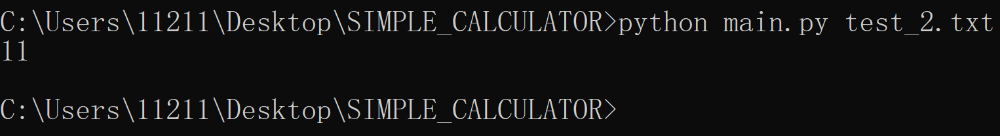

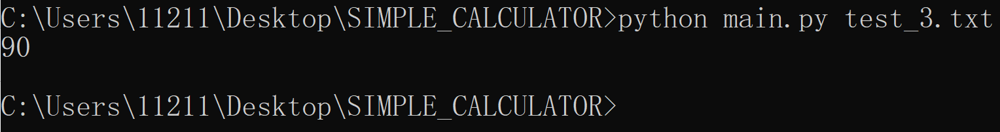

(3) All inputs are case insensitive

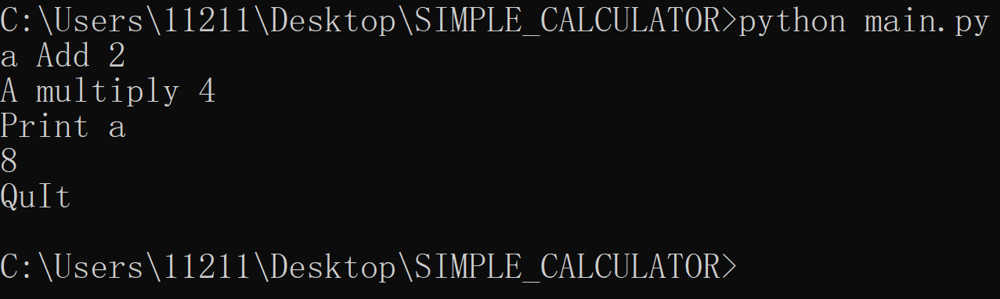

(4) Any name consisting of alphanumeric characters are allowed as register names:

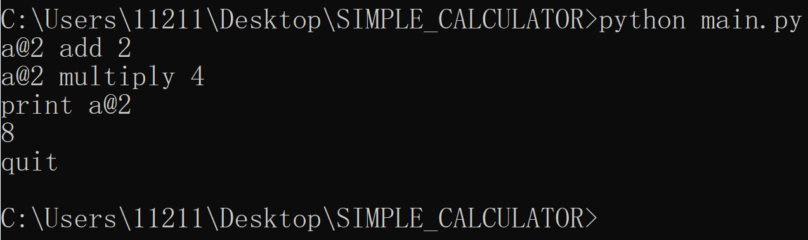


## Invalid commands and warnings

Only the right syntaxes are accepted. Invalid commands will be ignored, and warnings will be logged to the console.

Some examples of invalid commands and the related warnings are shown below:

(1) Operation not supported:

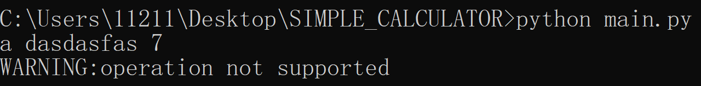

(2) Print the register that doesn't exist:

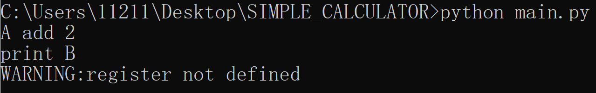

(3) Register name consists of only numbers:

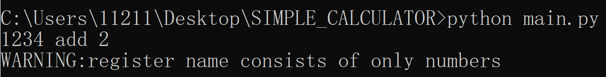

(4) The number of words in one command is invalid: 

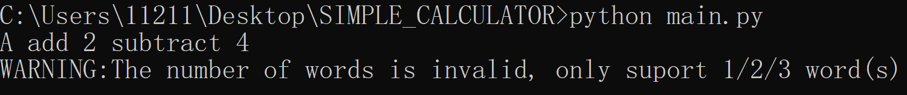

(5) The operations between registers can't be solved:

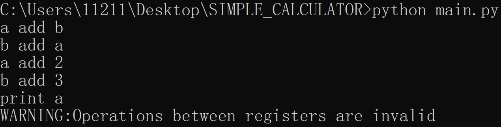

(6) Wrong spelling for 'quit':

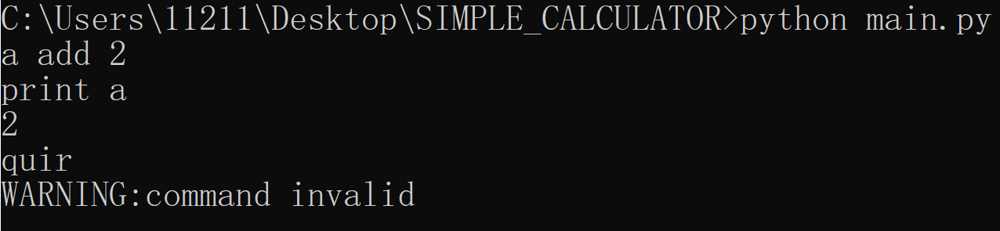

(7) Wrong spelling for 'print':

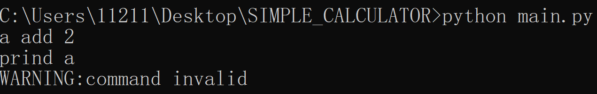

(8) When launching the program from the command prompt, not right number of arguments are entered:

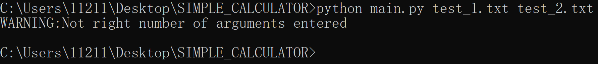
